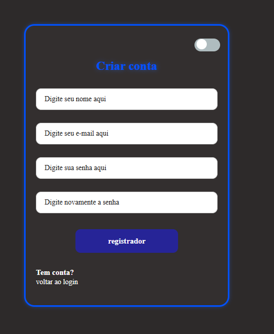
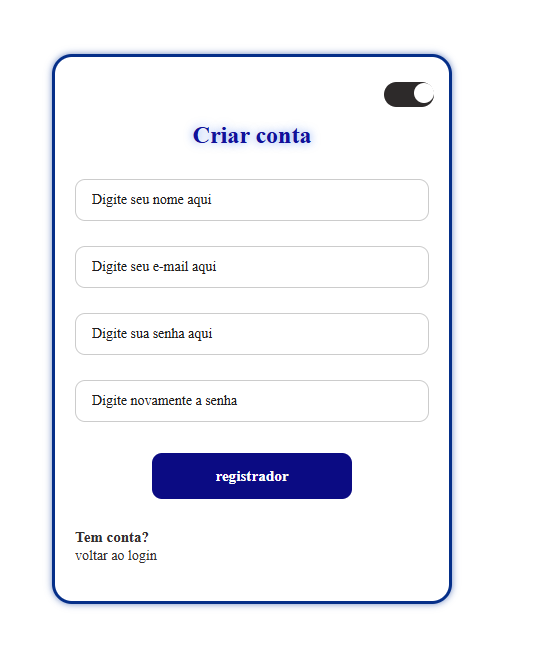

# 📝 Tela de Registro (Light & Dark Mode)

Este projeto apresenta uma interface de formulário de registro (Criar Conta) moderna, com um sistema integrado de troca de temas entre modo claro e modo escuro.


## ✨ Funcionalidades

- **Campos de Entrada:** Nome, e-mail, senha e confirmação de senha.
- **Alternador de Tema:** Um botão switch (toggle) que altera instantaneamente o visual da página.
- **Design Adaptativo:** Cores e bordas que se ajustam para garantir legibilidade e conforto visual em qualquer ambiente.
- **Identidade Visual:** Uso de sombras suaves no modo claro e brilho neon no modo escuro.

## 🛠️ Tecnologias Utilizadas

- **HTML5**: Estrutura do formulário e dos campos.
- **CSS3**: Estilização avançada, transições suaves e variáveis para gerenciamento de cores.
- **JavaScript**: Lógica de manipulação do DOM para alternância das classes de tema.

## 📸 Demonstração

### 🌙 Modo Escuro


### ☀️ Modo Claro


## 📂 Estrutura do Formulário

O formulário contém os seguintes campos traduzidos:
1. **Nome:** `Digite seu nome aqui`
2. **E-mail:** `Digite seu e-mail aqui`
3. **Senha:** `Digite sua senha aqui`
4. **Confirmação:** `Digite novamente a senha`
5. **Botão:** `Registrador`

---

## 🚀 Como testar localmente

1. Faça o download ou clone este repositório:
   ```bash
   git clone [https://github.com/seu-usuario/seu-repositorio.git](https://github.com/seu-usuario/seu-repositorio.git)
